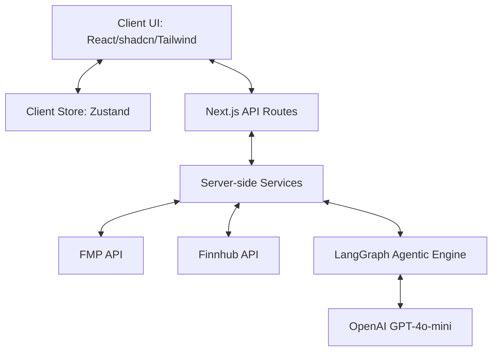

# Architecture & System Design

This document details the architectural design and software patterns used in the AI Investment Research Assistant.

## System Overview

The system is designed as a modular, state-driven single-page application built on Next.js 16 with a clean separation between the user interface, client-side state management, server-side API proxy routes, and the AI agent orchestration layer.

---

## Key Architectural Patterns

### 1. Separation of Concerns (Clean Architecture)
- **Presentation Layer (`src/components`)**: Pure UI components, dashboards, charts, and input forms. They read state from Zustand stores and dispatch actions.
- **Client State Layer (`src/store`)**: Global Zustand stores managing UI states, watchlists, chat sessions, and comparisons.
- **API Client Layer (`src/lib/api/client.ts`)**: Base Axios fetcher configuration to communicate securely with internal API routes.
- **Validation Layer (`src/lib/validation`)**: Enforces input structure using Zod schemas on both frontend inputs and server env profiles.
- **Server Data Layer (`src/services`)**: Business logic executing on the Next.js server, fetching external data from Finnhub & Financial Modeling Prep without leaking credentials to client requests.
- **Agent Orchestration Layer (`src/lib/langgraph`)**: Coordinates stateful multi-step AI reasoning workflows.

### 2. State-Driven UI
State flows unidirectionally from the Zustand store to the UI layout. The UI triggers actions that update the store, and changes propagate automatically.

### 3. Secure Server Proxies
The client never directly requests data from Finnhub or FMP. All external queries are proxied via Next.js api routes to safeguard confidential developer keys and prevent browser CORS blocks.

### 4. Schema-First Validation
Every critical input (such as Stock Ticker symbols, parameters, and AI model inputs) passes Zod validation schemas prior to executing fetch operations or prompting AI layers.
