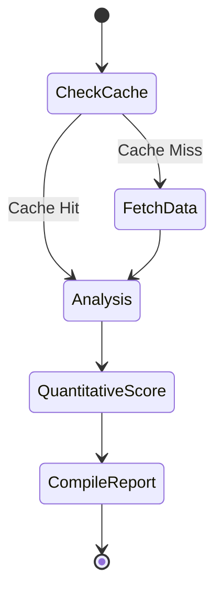

# LangGraph Agentic Engine

This document describes the design of the stateful agent orchestration graph built with LangGraph.js.

## Agent Workflow Design

The AI Investment Research Assistant processes user inquiries using a multi-node State Graph. Each node acts as a specialized specialist step executing logic or querying LLMs.



---

## 1. Graph State Definition

The shared context state carried across all nodes in the graph includes:

```typescript
interface AgentState {
  // Conversational history
  messages: Array<{ role: string; content: string }>;
  
  // Targets
  ticker: string;
  
  // Harvested financial files
  companyProfile?: any;
  financialMetrics?: any[];
  marketNews?: any[];
  
  // Calculations
  scores?: Record<string, number>;
  recommendation?: string;
  
  // Final compiled output
  reportMarkdown?: string;
}
```

---

## 2. Specialized Nodes

### `CheckCacheNode`
Queries server-side caches. If recent quote summaries exist, pre-fills the state, skipping external database hits.

### `FetchDataNode`
Utilizes [fmpClient](file:///d:/Ai%20Investment%20Agent/investment-research-agent/src/lib/api/fmp.ts) and [finnhubClient](file:///d:/Ai%20Investment%20Agent/investment-research-agent/src/lib/api/finnhub.ts) in parallel.
- Fetches profile info.
- Gathers key financials (Income, Balance, Cash flow statements).
- Pulls top news sentiments from the Finnhub endpoint.

### `AnalysisNode`
Uses OpenAI `GPT-4o-mini` to evaluate raw data:
- Audits performance flags (e.g. rising debt levels, falling margins).
- Reviews news sentiment context.

### `QuantitativeScoreNode`
Applies weights configured by the user to evaluate:
- **Valuation**: P/E, PEG, EV/EBITDA ratios.
- **Profitability**: Net Margin, ROE, ROCE trends.
- **Growth**: Year-over-year revenue and EPS growth rates.
- **Solvency**: Quick Ratio, Debt-to-Equity structures.
- **Momentum**: Stock performance compared to S&P 500 averages.

### `CompileReportNode`
Drafts a markdown briefing report summarizing findings, scores, and clear "BUY/HOLD/SELL" calls, returning results to the client.
